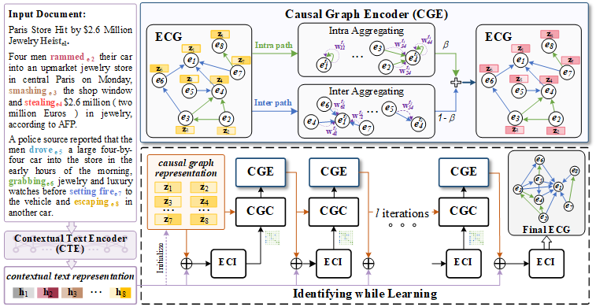

# Identifying while Learning for Document Event Causality Identification

This is the code of the paper *Identifying while Learning for Document Event Causality Identification*. Accepted by ACL 2024.

An *iterative Learning and Identifying Framework* (iLIF) for the document-level event causality identification.

## Overview


Illustration of the *iterative Learning and Identifying Framework* (**iLIF**). Causality identification is based on *events’ contextual text and causal graph representations*. The *event causality graph* (**ECG**) is iteratively constructed to update events’ causal graph representations. The final ECG contains all identified causal relations as the output.

## Requirements

- python==3.7.13
- transformers==4.15.0
- matplotlib==3.5.3
- numpy==1.21.5
- scikit-learn==1.0.2
- scipy==1.7.3
- torch==1.11.0
- torch_scatter==2.0.9
- torch_geometric==2.1.0.post1
- tqdm==4.64.1

## Usage

All training commands are listed in [parameter.py](https://github.com/LchengC/iLIF/blob/master/parameter.py). For example, you can run the following commands to train iLIF on the EventStoryLine v0.9 datasets.

```
# the EventStoryLine v0.9
python main.py --t_lr 2e-5 --lr 1e-4 --w 0.6 --threshold 2 --epoch 30 --batch_size 1 --beta_intra 0.3 --beta_inter 0.7 --max_iteration 9 --min_iteration 2 --num_heads 4 --mlp_drop 0.4 --seed 209 --gamma 2.0
```

## Data

We provide a processed datasets: the EventStoryLine v0.9 for testing

- For the initial version of the datasets, please visit the [EventStoryLine](https://github.com/cltl/EventStoryLine/).
- For the complete version of the datasets, please visit the [EventStoryLine](https://github.com/tommasoc80/EventStoryLine/).
- *EventStoryLine_bert_intra_and_inter_dev_features.pkl*：the development data of the EventStoryLine v0.9
- *EventStoryLine_bert_intra_and_inter_train_features.pkl*：the training and test data of the EventStoryLine v0.9

## Acknowledgement

We refer to the code of [HAN](https://github.com/Jhy1993/HAN). Thanks for their contributions.

## Citation
